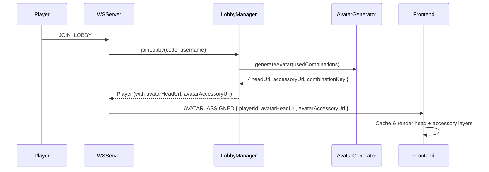
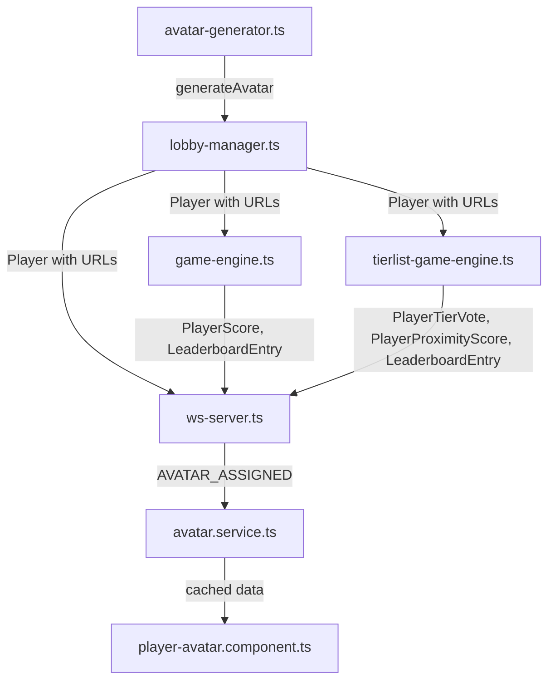

# Design Document: Cloudflare Avatar System

## Overview

This feature replaces the current SVG-based avatar generation system with a Cloudflare R2-hosted PNG image avatar system. Instead of composing SVG avatars from feature layers (face shape, skin color, eyes, mouth, hair, accessories), the new system selects a unique combination of a head image and an optional accessory image from a predefined set of PNG assets hosted on Cloudflare R2.

Each avatar is composed of two layers:
- A **head** (foreground) — one of 15 PNG images
- An **accessory** (background, optional) — one of 3 PNG images, or "none"

This yields 15 × 4 = 60 unique combinations per lobby. The backend selects a random unique combination per player, constructs Cloudflare URLs, and broadcasts them via WebSocket. The frontend composites the two layers (accessory behind head) for display.

### Key Design Decisions

1. **Two-field model over single URL**: Using `avatarHeadUrl` + `avatarAccessoryUrl` instead of a single combined image URL allows the frontend to composite layers with CSS, avoiding server-side image processing.
2. **Hardcoded asset registry**: Head and accessory names are defined as constants in the backend. Adding new assets only requires updating these arrays.
3. **Combination key format**: `"{head}|{accessory}"` (e.g., `"Antoine|Hood"`, `"Michel|none"`) — human-readable and simple to track uniqueness.
4. **URL encoding**: Head/accessory names containing spaces or special characters (e.g., "Dami le boss", "Ragnarok réel") are URL-encoded in the constructed URLs.
5. **Configurable base URL**: The Cloudflare R2 bucket URL is read from `CLOUDFLARE_AVATAR_BASE_URL` environment variable defined in a `.env` file at the backend root. No default value — the app throws at startup if the variable is missing.

## Architecture

The system follows the existing architecture pattern where the backend generates avatar data during lobby join and broadcasts it via WebSocket. The main change is replacing SVG composition with URL construction.



### Component Interaction



## Components and Interfaces

### Backend: `avatar-generator.ts` (Rewritten)

Replaces SVG composition with Cloudflare URL-based avatar selection.

```typescript
// Constants
export const HEADS: string[] = [
  'Alberto', 'Antoine', 'Charles', 'Cyprien', 'Dami le boss',
  'Damien', 'Dorian', 'Doriprogra', 'Grotoine', 'Jonathan Normal',
  'Jonathan', 'Michel', 'Miel', 'Ragnarok réel', 'Ragnarok',
];

export const ACCESSORIES: string[] = ['Collar', 'Fool', 'Hood'];

export const ACCESSORY_OPTIONS: string[] = [...ACCESSORIES, 'none'];

const MAX_REROLL_ATTEMPTS = 1000;

export interface AvatarResult {
  headUrl: string;
  accessoryUrl: string | null;
  combinationKey: string;
}

export function generateAvatar(usedCombinations: Set<string>): AvatarResult;
export function buildHeadUrl(headName: string): string;
export function buildAccessoryUrl(accessoryName: string): string | null;
export function buildCombinationKey(head: string, accessory: string): string;
```

### Backend: `lobby-manager.ts` (Updated)

- `joinLobby()` stores `avatarHeadUrl` and `avatarAccessoryUrl` on the Player object instead of `avatarDataUri`.

### Backend: `ws-server.ts` (Updated)

- `handleJoinLobby()` broadcasts `avatarHeadUrl` and `avatarAccessoryUrl` in AVATAR_ASSIGNED messages.
- `handleReconnection()` sends `avatarHeadUrl` and `avatarAccessoryUrl` for all players.

### Backend: `game-engine.ts`, `tierlist-game-engine.ts`, `scoring-engine.ts`, `tierlist-scoring-engine.ts` (Updated)

- All references to `player.avatarDataUri` change to `player.avatarHeadUrl` and `player.avatarAccessoryUrl`.
- `PlayerScore`, `LeaderboardEntry`, `PlayerTierVote`, `PlayerProximityScore` payloads carry the new fields.

### Frontend: `avatar.service.ts` (Updated)

```typescript
interface AvatarData {
  headUrl: string;
  accessoryUrl: string | null;
}

// Cache changes from Map<string, string> to Map<string, AvatarData>
// getAvatar returns AvatarData | undefined instead of string | undefined
```

### Frontend: `player-avatar.component.ts` (Updated)

```typescript
// Inputs change from single `src` to:
readonly headSrc = input<string | undefined>();
readonly accessorySrc = input<string | null | undefined>();

// Template renders accessory behind head using CSS positioning
```

### Frontend: Game Components (Updated)

All components that call `avatarService.getAvatar()` and pass the result to `<app-player-avatar>` are updated to pass `headSrc` and `accessorySrc` instead of `src`:
- `tierlist-lobby.component.ts`
- `tierlist-gameplay.component.ts`
- `tierlist-round-result.component.ts`
- `tierlist-end-game.component.ts`

## Data Models

### Shared Types (`shared/types.ts`)

```typescript
// Before:
export interface Player {
  avatarDataUri: string;
  // ...other fields
}

// After:
export interface Player {
  avatarHeadUrl: string;
  avatarAccessoryUrl: string | null;
  // ...other fields
}
```

### WebSocket Payloads (`shared/ws-messages.ts`)

All payload interfaces that previously had `avatarDataUri: string` are updated to:

```typescript
avatarHeadUrl: string;
avatarAccessoryUrl: string | null;
```

Affected interfaces:
- `AvatarAssignedPayload`
- `PlayerScore`
- `LeaderboardEntry`
- `PlayerTierVote`
- `PlayerProximityScore`

### Avatar Generator Result

```typescript
// Before:
export interface AvatarResult {
  dataUri: string;
  combinationKey: string; // e.g., "2-3-5-1-7-4-2"
}

// After:
export interface AvatarResult {
  headUrl: string;           // e.g., "https://...r2.dev/heads/Antoine.png"
  accessoryUrl: string | null; // e.g., "https://...r2.dev/accessories/Hood.png" or null
  combinationKey: string;    // e.g., "Antoine|Hood"
}
```

### Environment Configuration

The backend loads environment variables from a `.env` file at the backend root (`backend/.env`) using the `dotenv` package. This file is already excluded from git via `.gitignore`.

A `.env.example` file is committed to the repo to document required variables.

| Variable | Required | Description |
|---|---|---|
| `CLOUDFLARE_AVATAR_BASE_URL` | Yes | Base URL for Cloudflare R2 avatar assets (e.g., `https://pub-urlid.r2.dev`) |

If `CLOUDFLARE_AVATAR_BASE_URL` is not set, `generateAvatar()` throws an error.


## Correctness Properties

*A property is a characteristic or behavior that should hold true across all valid executions of a system — essentially, a formal statement about what the system should do. Properties serve as the bridge between human-readable specifications and machine-verifiable correctness guarantees.*

### Property 1: Avatar combination validity

*For any* generated avatar, the combination key SHALL be in the format `"{head}|{accessory}"` where `head` is one of the 15 defined head names and `accessory` is one of the 3 defined accessory names or `"none"`.

**Validates: Requirements 1.1, 1.2, 1.5**

### Property 2: Avatar uniqueness within a lobby

*For any* lobby with N players (N ≤ 60), all N generated avatars SHALL have distinct combination keys. The shared `usedCombinations` set SHALL contain exactly N entries after N generations.

**Validates: Requirements 1.3, 8.1**

### Property 3: URL construction correctness

*For any* generated avatar, the head URL SHALL equal `"{baseUrl}/heads/{encodeURIComponent(head)}.png"` and the accessory URL SHALL equal `"{baseUrl}/accessories/{encodeURIComponent(accessory)}.png"` when accessory is not `"none"`, or `null` when accessory is `"none"`. Parsing the URLs back should recover the original head and accessory names from the combination key.

**Validates: Requirements 2.2, 2.3, 2.4, 2.5**

## Error Handling

| Scenario | Behavior |
|---|---|
| All 60 avatar combinations exhausted in a lobby | `generateAvatar()` throws `Error('Unable to generate unique avatar after maximum reroll attempts')` after 1000 attempts |
| `CLOUDFLARE_AVATAR_BASE_URL` env var not set | `generateAvatar()` throws `Error('CLOUDFLARE_AVATAR_BASE_URL environment variable is required')` |
| Head/accessory name contains special characters | URL-encoded via `encodeURIComponent()` (e.g., "Dami le boss" → "Dami%20le%20boss", "Ragnarok réel" → "Ragnarok%20r%C3%A9el") |
| Frontend receives `avatarAccessoryUrl: null` | `player-avatar.component` renders only the head image, no accessory layer |
| Frontend receives no head URL (undefined) | `player-avatar.component` renders fallback placeholder |
| Player leaves lobby | Combination key remains in `usedCombinations` to prevent reuse within the session |
| Lobby destroyed | All tracked combination keys for that lobby are released |

## Testing Strategy

### Unit Tests (Example-Based)

- **Asset registry**: Verify `HEADS` contains exactly 15 expected names, `ACCESSORIES` contains exactly 3 expected names, `ACCESSORY_OPTIONS` includes "none".
- **Environment variable**: Verify `buildHeadUrl` and `buildAccessoryUrl` use `CLOUDFLARE_AVATAR_BASE_URL` when set, and fall back to default when not set.
- **Accessory "none" handling**: Verify `buildAccessoryUrl("none")` returns `null`.
- **Exhaustion error**: Fill all 60 combinations, verify `generateAvatar()` throws.
- **Combination key retention on leave**: Join a player, leave, join another — verify no key reuse.
- **Lobby cleanup**: Create and destroy a lobby — verify combination tracking is cleaned up.
- **Frontend component rendering**: Verify head-only rendering (null accessory), head+accessory rendering, and fallback placeholder.
- **Frontend cache**: Verify `AvatarService` caches and returns `{ headUrl, accessoryUrl }` per player, and clears on destroy.

### Property-Based Tests (fast-check)

Property-based tests use the `fast-check` library (already a project dependency). Each test runs a minimum of 100 iterations.

- **Property 1 — Avatar combination validity**: Generate random avatars and verify the combination key format and component validity.
  - Tag: `Feature: cloudflare-avatar-system, Property 1: Avatar combination validity`
- **Property 2 — Avatar uniqueness within a lobby**: Generate N avatars (N ∈ [1, 60]) with a shared `usedCombinations` set and verify all keys are distinct.
  - Tag: `Feature: cloudflare-avatar-system, Property 2: Avatar uniqueness within a lobby`
- **Property 3 — URL construction correctness**: For any head/accessory from the valid sets, verify URL construction produces correctly formatted and encoded URLs, and that "none" maps to null.
  - Tag: `Feature: cloudflare-avatar-system, Property 3: URL construction correctness`

### Integration Tests

- **WebSocket avatar broadcasting**: Verify AVATAR_ASSIGNED messages contain `avatarHeadUrl` and `avatarAccessoryUrl` when a player joins.
- **Reconnection avatar sync**: Verify reconnecting players receive AVATAR_ASSIGNED messages for all lobby players with the new fields.
- **End-to-end game flow**: Verify `PlayerScore`, `LeaderboardEntry`, `PlayerTierVote`, and `PlayerProximityScore` payloads carry the new avatar fields throughout a game session.
