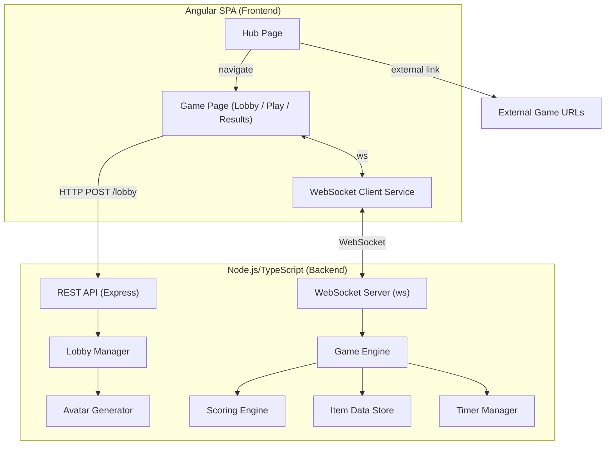

# Design Document: Multiplayer Game Hub

## Overview

The Multiplayer Game Hub is a real-time web application built with an Angular frontend and a Node.js/TypeScript backend. It serves as a central portal for browser-based multiplayer games, with the first game being a consensus-based ranking game. Players join games via a single shareable URL (`/game/ranking/:code`) that serves as the lobby, gameplay, and results page — rendering different views based on the current game phase. Players receive randomized avatars and compete across configurable rounds by drag-and-drop ranking items. Scoring rewards agreement with the group average. Players can join at any point; those who join mid-game spectate until the next rematch. Rematches auto-start after a 30-second countdown without requiring host action. If the host leaves, the host role is reassigned to the next player. The system uses WebSockets for real-time state synchronization and a playful, Gartic Phone-inspired visual design using custom SCSS.

The hub also aggregates external multiplayer games (Gartic Phone, JKLM.fun Bomb Party, Dialed.gg, JKLM.fun Popsauce) as linked cards alongside internal games.

## Architecture

The system follows a client-server architecture with real-time communication via WebSockets.



### Key Architectural Decisions

1. **WebSocket library: `ws`** — Lightweight, well-maintained, no unnecessary abstractions. Socket.IO is heavier than needed since we don't require fallback transports (modern browsers all support WebSockets).

2. **Express for REST endpoints** — Used only for lobby creation and game configuration. Minimal surface area.

3. **In-memory game state** — No database. Lobbies and game sessions live in server memory. This is appropriate for a party game with ephemeral sessions. If the server restarts, games are lost — acceptable for this use case.

4. **Angular CDK DragDrop** — Angular's `@angular/cdk/drag-drop` module for the ranking drag-and-drop interaction. It's part of the Angular ecosystem, not a UI component library, so it satisfies the "no UI libraries" constraint.

5. **Canvas-based avatar generation** — Avatars are composed server-side from a set of SVG facial feature layers and sent as data URIs. This avoids needing a sprite sheet on the client.

6. **JSON message protocol over WebSocket** — All WebSocket messages are JSON-encoded with a `type` field for routing. Simple, debuggable, no binary protocol overhead needed.

## Components and Interfaces

### Frontend Components (Angular)

#### Hub Page (`/`)
- Displays game cards (internal + external) in a responsive grid
- Internal cards: clicking creates a new lobby (POST to REST API) and navigates to `/game/ranking/:code`
- External cards open URLs in new tabs with an external link icon
- Game card data loaded from a configurable JSON source

#### Game Page (`/game/ranking/:code`) — Unified View
This is the single URL for the entire game lifecycle. The page renders different views based on the lobby's current `state`:

**Lobby Phase (`state: 'waiting'`)**
- Host view: settings configuration (rounds 1–20, timer 5–120s, mode category/random) alongside the player list — all in one unified view
- Non-host view: player list with avatars and usernames, waiting for host to start
- Join flow: username prompt → WebSocket connection → avatar assigned
- Shareable link display with copy button
- Host sees "Start Game" button
- Spectator badge shown for players who joined mid-game (only visible during rematch lobby)

**Gameplay Phase (`state: 'playing'`)**
- 5 item cards with image + text overlay
- Drag-and-drop reordering via `@angular/cdk/drag-drop`
- Round timer countdown display
- Submit button (or auto-submit on timer expiry)
- Round number indicator
- Spectators see a read-only view with a "Spectating" indicator — they cannot submit rankings

**Round Results Phase (between rounds)**
- Average ranking display for the round
- Per-player scores with avatars
- Cumulative leaderboard
- Host clicks "Next Round" to advance (or auto-advance to end-of-game)

**End-of-Game / Results Phase (`state: 'results'`)**
- Final leaderboard sorted by total consensus score
- Winner highlight with crown animation
- 30-second rematch countdown (auto-starts without host action)
- Players can leave before countdown expires to opt out

**Rematch Transition**
- When rematch countdown expires, the page transitions back to the gameplay phase automatically
- Same URL is preserved — no navigation occurs
- Spectators are promoted to active participants

### Backend Services

#### REST API Endpoints

| Method | Path | Description |
|--------|------|-------------|
| `POST` | `/api/lobbies` | Create a new lobby. Body: `{ rounds, timerSeconds, mode }`. Returns `{ lobbyCode, joinUrl }` |
| `GET` | `/api/lobbies/:code` | Get lobby status (exists, state, player count, config) |
| `GET` | `/api/games` | Get list of internal + external game metadata |

#### WebSocket Message Protocol

All messages are JSON with shape `{ type: string, payload: object }`.

**Client → Server:**

| Type | Payload | Description |
|------|---------|-------------|
| `JOIN_LOBBY` | `{ lobbyCode, username }` | Player joins a game (any phase) |
| `START_GAME` | `{ lobbyCode }` | Host starts the game |
| `SUBMIT_RANKING` | `{ lobbyCode, roundIndex, ranking: string[] }` | Active player submits their ranking |
| `LEAVE_LOBBY` | `{ lobbyCode }` | Player leaves voluntarily |
| `UPDATE_CONFIG` | `{ lobbyCode, config: Partial<GameConfig> }` | Host updates game settings during lobby phase |

**Server → Client:**

| Type | Payload | Description |
|------|---------|-------------|
| `LOBBY_UPDATE` | `{ players: Player[], hostId, config: GameConfig }` | Player list or config changed |
| `GAME_STARTED` | `{ roundIndex, items: Item[], timerSeconds }` | Round begins |
| `TIMER_TICK` | `{ secondsRemaining }` | Timer update |
| `ROUND_ENDED` | `{ roundIndex, averageRanking, scores: PlayerScore[], leaderboard }` | Round results |
| `GAME_ENDED` | `{ leaderboard, winnerId, isTie }` | Final results |
| `REMATCH_COUNTDOWN` | `{ secondsRemaining }` | Rematch timer |
| `REMATCH_STARTED` | `{ roundIndex, items: Item[], timerSeconds }` | Rematch auto-started, first round begins |
| `PLAYER_DISCONNECTED` | `{ playerId, username }` | Player dropped |
| `PLAYER_RECONNECTED` | `{ playerId, username }` | Player reconnected |
| `HOST_CHANGED` | `{ newHostId, newHostUsername }` | Host reassigned to another player |
| `JOINED_AS_SPECTATOR` | `{ gameState, currentRound, leaderboard }` | Sent to player who joined mid-game |
| `ERROR` | `{ message }` | Error notification |
| `AVATAR_ASSIGNED` | `{ playerId, avatarDataUri }` | Avatar generated |

### Frontend Services (Angular)

#### WebSocketService
- Manages WebSocket connection lifecycle (connect, reconnect, disconnect)
- Exposes Observable streams per message type
- Handles reconnection with 15-second grace period

#### LobbyService
- REST calls for lobby creation/status via native `fetch`
- Lobby state management

#### GameStateService
- Manages current game phase (`waiting`, `playing`, `round_results`, `results`, `rematch_countdown`)
- Drives which view the Game Page renders
- Manages current round, items, timer, rankings
- Tracks player role (host, active participant, spectator)
- Coordinates between WebSocket events and UI state
- Handles rematch auto-start transition

#### AvatarService
- Receives and caches avatar data URIs from server

### Backend Modules

#### LobbyManager
- Creates/destroys lobbies
- Manages player join/leave at any game phase
- Marks players joining during `playing` or `results` state as spectators
- Generates unique 6-character alphanumeric lobby codes
- Tracks host assignment
- Handles host reassignment: when host leaves, assigns host role to next player in join order
- Broadcasts `HOST_CHANGED` message on reassignment

#### GameEngine
- Orchestrates round lifecycle: start → timer → collect rankings → score → results
- Manages round transitions and early completion
- Handles rematch flow: 30-second countdown → auto-start (no host action needed)
- On rematch start, promotes spectators to active participants
- Reuses same lobby code across rematches

#### ScoringEngine
- Computes average ranking per item across all players
- Calculates consensus score per player (inverse of sum of absolute differences)
- Maintains cumulative leaderboard

#### ItemStore
- Stores items organized by category
- Provides item selection for Category_Mode and Random_Mode
- Tracks used items per session to prevent repeats

#### AvatarGenerator
- Composes randomized cartoon-face avatars from feature layers
- Ensures visual distinctness within a lobby by tracking used combinations

#### TimerManager
- Manages per-round countdown timers
- Broadcasts tick events via WebSocket
- Triggers round end on expiry


## Data Models

### Player

```typescript
interface Player {
  id: string;            // UUID, assigned on WebSocket connect
  username: string;
  avatarDataUri: string;  // Base64-encoded SVG avatar
  socketId: string;       // WebSocket connection ID
  isHost: boolean;
  isConnected: boolean;
  isSpectator: boolean;   // True if joined after lobby phase ended
  hasCrown: boolean;      // True if winner of previous game in rematch
  joinOrder: number;      // Order in which player joined, used for host reassignment
}
```

### Lobby

```typescript
interface Lobby {
  code: string;              // 6-char alphanumeric
  hostId: string;            // Player ID of the host
  players: Map<string, Player>;
  config: GameConfig;
  state: LobbyState;         // 'waiting' | 'playing' | 'round_results' | 'results' | 'rematch_countdown'
  gameSession: GameSession | null;
  previousWinnerId: string | null;
  createdAt: number;         // Timestamp
  nextJoinOrder: number;     // Counter for assigning join order
}
```

### GameConfig

```typescript
interface GameConfig {
  rounds: number;            // 1–20
  timerSeconds: number;      // 5–120, default 15
  mode: 'category' | 'random';
}
```

### GameSession

```typescript
interface GameSession {
  currentRound: number;      // 0-indexed
  totalRounds: number;
  rounds: RoundData[];
  usedItemIds: Set<string>;  // Prevent repeats across rounds
  cumulativeScores: Map<string, number>; // playerId → total score
}
```

### RoundData

```typescript
interface RoundData {
  roundIndex: number;
  items: Item[];
  rankings: Map<string, string[]>;  // playerId → ordered item IDs
  averageRanking: string[];          // Item IDs in average order
  scores: Map<string, number>;       // playerId → round score
  timerStartedAt: number;
  isComplete: boolean;
}
```

### Item

```typescript
interface Item {
  id: string;
  displayName: string;
  imageUrl: string;
  category: string;
}
```

### GameCard (Hub)

```typescript
interface GameCard {
  id: string;
  title: string;
  description: string;
  imageUrl: string;
  isExternal: boolean;
  externalUrl?: string;      // Only for external games
  routePath?: string;        // Only for internal games
}
```

### WebSocket Message

```typescript
interface WSMessage {
  type: string;
  payload: Record<string, unknown>;
}
```

### Scoring Algorithm

The consensus scoring works as follows:

1. For each item, compute the average position across all players' rankings (1-indexed).
2. For each player, compute the sum of absolute differences between their ranking position and the average position for each item.
3. Convert to a score: `score = maxPossibleDifference - totalDifference`, where `maxPossibleDifference` is the theoretical maximum sum of differences (ensures higher score = closer to consensus).
4. The maximum possible difference for 5 items ranked 1–5 is `2 * (4 + 3 + 2 + 1 + 0) = 20` (when every item is maximally displaced from the average).

```typescript
function computeConsensusScores(
  rankings: Map<string, string[]>, // playerId → ordered itemIds
  itemIds: string[]
): Map<string, number> {
  const playerIds = Array.from(rankings.keys());
  const numItems = itemIds.length;

  // Compute average position for each item (1-indexed)
  const avgPosition = new Map<string, number>();
  for (const itemId of itemIds) {
    let sum = 0;
    for (const playerId of playerIds) {
      const rank = rankings.get(playerId)!;
      sum += rank.indexOf(itemId) + 1; // 1-indexed
    }
    avgPosition.set(itemId, sum / playerIds.length);
  }

  // Compute score per player
  const maxDiff = numItems * (numItems - 1); // Theoretical max total difference
  const scores = new Map<string, number>();
  for (const playerId of playerIds) {
    const rank = rankings.get(playerId)!;
    let totalDiff = 0;
    for (let i = 0; i < rank.length; i++) {
      totalDiff += Math.abs((i + 1) - avgPosition.get(rank[i])!);
    }
    scores.set(playerId, Math.round((maxDiff - totalDiff) * 100) / 100);
  }

  return scores;
}
```

### Avatar Generation

Avatars are composed from randomized layers:

| Layer | Options |
|-------|---------|
| Face shape | 6 variants |
| Skin color | 8 tones |
| Eyes | 10 styles |
| Mouth | 8 styles |
| Hair | 12 styles × 8 colors |
| Accessories | 6 options (glasses, hats, none, etc.) |

Total combinations: 6 × 8 × 10 × 8 × 96 × 6 = ~2.2 million — more than enough for uniqueness within a lobby. The generator tracks used combinations per lobby and rerolls on collision.


## Correctness Properties

*A property is a characteristic or behavior that should hold true across all valid executions of a system — essentially, a formal statement about what the system should do. Properties serve as the bridge between human-readable specifications and machine-verifiable correctness guarantees.*

### Property 1: GameConfig validation accepts valid ranges and rejects invalid ranges

*For any* integer `rounds`, the lobby creation validation SHALL accept it if and only if `1 <= rounds <= 20`. *For any* integer `timerSeconds`, the validation SHALL accept it if and only if `5 <= timerSeconds <= 120`. When `timerSeconds` is omitted, it SHALL default to 15.

**Validates: Requirements 2.4, 2.5**

### Property 2: Avatar completeness

*For any* generated avatar, it SHALL contain all required facial feature layers: face shape, skin color, eyes, mouth, hair (style and color), and accessories. Each feature value SHALL be within its valid set of options.

**Validates: Requirements 4.1**

### Property 3: Avatar uniqueness within a lobby

*For any* lobby with N players (N ≤ 20), all N generated avatars SHALL have distinct feature combinations (no two players share the same tuple of face shape, skin color, eyes, mouth, hair style, hair color, and accessory).

**Validates: Requirements 4.2**

### Property 4: Round completion captures current rankings

*For any* round with N players, when the round ends (either by timer expiry or all players submitting), the recorded rankings for each player SHALL equal their most recent ranking order. If a player never reordered, their recorded ranking SHALL equal the default item order.

**Validates: Requirements 5.6, 5.7**

### Property 5: Category mode selects items from a single category

*For any* round played in Category_Mode, all 5 selected items SHALL belong to the same category.

**Validates: Requirements 6.1**

### Property 6: Random mode selects items from multiple categories

*For any* round played in Random_Mode (given an item store with at least 2 categories each having at least 3 items), the 5 selected items SHALL span at least 2 distinct categories.

**Validates: Requirements 6.2**

### Property 7: No item repetition across rounds

*For any* game session with R rounds, the union of all item IDs across all rounds SHALL contain exactly `5 × R` unique item IDs (no duplicates).

**Validates: Requirements 6.3**

### Property 8: Scoring algorithm correctness

*For any* set of N players' rankings of 5 items, the computed average position for each item SHALL equal the arithmetic mean of that item's position across all players' rankings (1-indexed). Each player's consensus score SHALL equal `maxDiff - Σ|playerPosition(item) - avgPosition(item)|` for all items, where `maxDiff = numItems × (numItems - 1)`.

**Validates: Requirements 7.1, 7.2**

### Property 9: Scoring monotonicity — closer to consensus means higher score

*For any* two players A and B in the same round, if the sum of absolute differences from the average ranking for player A is less than for player B, then player A's consensus score SHALL be strictly greater than player B's consensus score.

**Validates: Requirements 7.3**

### Property 10: Leaderboard sorting and winner determination

*For any* set of player scores, the leaderboard SHALL be sorted in descending order by total consensus score. The winner(s) SHALL be exactly the set of players whose total score equals the maximum score. If multiple players share the maximum score, all SHALL be declared co-winners.

**Validates: Requirements 8.3, 9.1, 9.3**

### Property 11: Rematch lobby membership, crown assignment, and spectator promotion

*For any* set of players (including spectators) at rematch countdown expiry, the new game SHALL include exactly the players who remained connected. All spectators SHALL be promoted to active participants (`isSpectator = false`). If the previous game's winner is among the connected players, that player's `hasCrown` SHALL be `true`; all other players' `hasCrown` SHALL be `false`. The rematch SHALL start automatically without requiring a `START_GAME` message from the host.

**Validates: Requirements 10.2, 10.4, 10.5, 10.6, 10.7**

### Property 12: Game card rendering completeness

*For any* list of game cards (internal and external), the hub page SHALL render all cards. Each card SHALL display its title and description. External cards SHALL include an external link indicator. Internal cards SHALL not have an external link indicator.

**Validates: Requirements 1.1, 2.7, 15.1, 15.4**

### Property 13: Spectator assignment based on join timing

*For any* player joining a lobby, if the lobby state is `'waiting'`, the player's `isSpectator` SHALL be `false` (active participant). If the lobby state is `'playing'`, `'round_results'`, or `'results'`, the player's `isSpectator` SHALL be `true` (spectator).

**Validates: Requirements 3.3, 3.4**

### Property 14: Host reassignment follows join order

*For any* lobby with N players (N ≥ 2), when the current host leaves (voluntarily or by disconnect timeout), the player with the lowest `joinOrder` among remaining connected players SHALL become the new host. The lobby state and game session SHALL remain unchanged by the reassignment.

**Validates: Requirements 12.1, 12.4**

### Property 15: Game page renders correct view for lobby state

*For any* lobby state value (`'waiting'`, `'playing'`, `'round_results'`, `'results'`, `'rematch_countdown'`), the game page component SHALL render the corresponding view. No two distinct states SHALL render the same view.

**Validates: Requirements 2.2**

## Error Handling

### WebSocket Errors

| Scenario | Handling |
|----------|----------|
| Connection drop | Server retains session for 15s. Client auto-reconnects with exponential backoff (1s, 2s, 4s, 8s). On reconnect, server sends full state sync. |
| Invalid message format | Server responds with `ERROR` message and ignores the malformed message. Connection stays open. |
| Player sends action for wrong lobby | Server responds with `ERROR` message: "Not a member of this lobby." |
| Host disconnects during game | Game continues. If host doesn't reconnect within 15s, the next player in join order becomes host. `HOST_CHANGED` broadcast to all players. |
| Host leaves voluntarily | Next player in join order becomes host immediately. `HOST_CHANGED` broadcast to all players. |
| Spectator tries to submit ranking | Server responds with `ERROR`: "Spectators cannot submit rankings." |

### REST API Errors

| Scenario | HTTP Status | Response |
|----------|-------------|----------|
| Invalid GameConfig (rounds/timer out of range) | 400 | `{ error: "rounds must be between 1 and 20" }` |
| Invalid game mode | 400 | `{ error: "mode must be 'category' or 'random'" }` |
| Lobby not found | 404 | `{ error: "Lobby not found" }` |
| Server error | 500 | `{ error: "Internal server error" }` |

### Game Logic Errors

| Scenario | Handling |
|----------|----------|
| Not enough items for configured rounds | Server rejects lobby creation with error: "Not enough items for {rounds} rounds in {mode} mode." |
| Player submits ranking after round ended | Server ignores late submission silently. |
| Non-host tries to start game | Server responds with `ERROR`: "Only the host can start the game." |
| Player submits ranking with wrong items | Server responds with `ERROR`: "Invalid ranking — items don't match current round." |
| Lobby has only 1 player when host starts | Server responds with `ERROR`: "Need at least 2 players to start." |
| Spectator tries to submit ranking | Server responds with `ERROR`: "Spectators cannot submit rankings." |
| Non-host tries to update config | Server responds with `ERROR`: "Only the host can update settings." |
| All players leave lobby | Server destroys the lobby after a grace period. |
| Host leaves | Server reassigns host to next player in join order and broadcasts `HOST_CHANGED`. |

### Frontend Error Handling

- Network errors on REST calls: display toast notification with retry option
- WebSocket disconnect: show "Reconnecting..." overlay with spinner
- Invalid lobby link: redirect to hub page with error toast
- Browser tab hidden during round: timer continues server-side, ranking auto-submitted on expiry
- Mid-game join: show spectator overlay explaining they'll play in the next rematch

## Testing Strategy

### Unit Tests

Unit tests cover specific examples, edge cases, and component behavior:

**Backend unit tests:**
- Lobby creation with valid/invalid configs
- Game mode selection (category vs random)
- Round lifecycle state transitions
- Host reassignment on disconnect (next in join order)
- Host reassignment on voluntary leave
- Rematch flow with auto-start (no host action)
- Spectator join during active game
- Spectator promotion on rematch
- Item store loading and schema validation
- WebSocket message parsing and routing
- Config update during lobby phase (host only)

**Frontend unit tests:**
- Game page view switching based on lobby state
- Host view vs non-host view in lobby phase (settings visible only to host)
- Spectator view during gameplay (read-only, no submit button)
- Navigation routing (single `/game/ranking/:code` route)
- Drag-and-drop reorder state management
- Timer display formatting
- External game card link behavior (opens new tab)
- Responsive layout at key breakpoints
- Rematch countdown display and auto-transition

### Property-Based Tests

Property-based tests use [fast-check](https://github.com/dubzzz/fast-check) (TypeScript PBT library) with minimum 100 iterations per property.

Each property test references its design document property:

| Test | Property | Tag |
|------|----------|-----|
| GameConfig validation | Property 1 | `Feature: multiplayer-game-hub, Property 1: GameConfig validation` |
| Avatar completeness | Property 2 | `Feature: multiplayer-game-hub, Property 2: Avatar completeness` |
| Avatar uniqueness | Property 3 | `Feature: multiplayer-game-hub, Property 3: Avatar uniqueness` |
| Round completion rankings | Property 4 | `Feature: multiplayer-game-hub, Property 4: Round completion` |
| Category mode selection | Property 5 | `Feature: multiplayer-game-hub, Property 5: Category mode` |
| Random mode selection | Property 6 | `Feature: multiplayer-game-hub, Property 6: Random mode` |
| No item repeats | Property 7 | `Feature: multiplayer-game-hub, Property 7: No item repeats` |
| Scoring correctness | Property 8 | `Feature: multiplayer-game-hub, Property 8: Scoring correctness` |
| Scoring monotonicity | Property 9 | `Feature: multiplayer-game-hub, Property 9: Scoring monotonicity` |
| Leaderboard sorting + winners | Property 10 | `Feature: multiplayer-game-hub, Property 10: Leaderboard sorting` |
| Rematch membership + crown + spectator promotion | Property 11 | `Feature: multiplayer-game-hub, Property 11: Rematch membership` |
| Game card rendering | Property 12 | `Feature: multiplayer-game-hub, Property 12: Game card rendering` |
| Spectator assignment by join timing | Property 13 | `Feature: multiplayer-game-hub, Property 13: Spectator assignment` |
| Host reassignment by join order | Property 14 | `Feature: multiplayer-game-hub, Property 14: Host reassignment` |
| Game page view for lobby state | Property 15 | `Feature: multiplayer-game-hub, Property 15: Game page view` |

**Test configuration:**
- Library: `fast-check` 
- Minimum iterations: 100 per property
- Test runner: Jest (backend), Karma/Jasmine (Angular frontend)

### Integration Tests

Integration tests verify WebSocket communication and end-to-end flows:

- Player join → lobby broadcast to all clients
- Mid-game player join → receives spectator state and current game info
- Full round lifecycle: start → rank → submit → score → results
- Timer expiry auto-submission
- Early completion when all players submit
- Reconnection within 15-second grace period
- Reconnection after 15 seconds (player removed)
- Host disconnect → host reassignment broadcast
- Rematch countdown and auto-start (no host action)
- Spectator promotion on rematch start
- REST API endpoint responses
- Config update during lobby phase via WebSocket

### E2E Tests

End-to-end tests using Cypress or Playwright:

- Full game flow: create lobby → join → play rounds → see winner → rematch auto-starts
- Mid-game join: player joins during gameplay → sees spectator view → plays in rematch
- Host leaves: host disconnects → new host assigned → game continues
- Unified URL: all phases render at `/game/ranking/:code` without navigation
- External game card opens in new tab
- Mobile viewport gameplay
- Drag-and-drop ranking interaction
