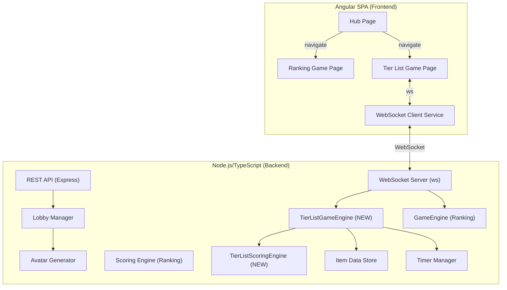

# Document de Design — Jeu de Vote Tier List

## Vue d'ensemble

Le Jeu de Vote Tier List est un nouveau jeu multijoueur FFA intégré au Game Hub existant, aux côtés du Ranking Game. Les joueurs rejoignent un lobby via une URL dédiée (`/game/tierlist/:code`), puis une animation de roulette sélectionne un thème (catégorie d'items.json). Pour chaque élément du thème, les joueurs votent secrètement en glissant-déposant l'élément vers un tier (S, A, B, C, D, F). Le placement final est déterminé par la moyenne des votes. Les joueurs gagnent des points de proximité selon la formule `Score_Proximité = 5 - |vote_joueur - moyenne|`. La partie se termine quand tous les éléments du thème ont été placés, puis un rematch automatique démarre après 30 secondes.

Le jeu réutilise intégralement l'infrastructure existante : LobbyManager, WebSocket server, système d'avatars, ItemStore, TimerManager, mécanisme de reconnexion et gestion de l'hôte. Il ajoute un nouveau `TierListGameEngine` spécifique à sa logique de jeu (vote par tier, scoring de proximité, phases de suspense) et de nouveaux types de messages WebSocket.

## Architecture

Le système étend l'architecture client-serveur existante. Le `TierListGameEngine` est un nouveau module backend parallèle au `GameEngine` existant (qui gère le Ranking Game). Le frontend ajoute une nouvelle page de jeu (`TierListGameComponent`) avec ses propres phases.



### Décisions architecturales clés

1. **Nouveau TierListGameEngine séparé du GameEngine existant** — Le Ranking Game et le Tier List Game ont des logiques de jeu fondamentalement différentes (classement de 5 items vs vote tier par tier pour N items). Un engine séparé évite de complexifier le GameEngine existant avec des branches conditionnelles.

2. **Nouveau TierListScoringEngine** — La formule de scoring est différente (proximité à la moyenne vs consensus de classement). Un module de scoring dédié garde la séparation des responsabilités.

3. **Réutilisation du LobbyManager existant** — Le système de lobby (création, join, spectateurs, hôte, reconnexion) est identique. Le lobby stocke un `gameType` pour router vers le bon engine.

4. **Extension du protocole WebSocket** — Nouveaux types de messages ajoutés aux constantes `CLIENT_MSG` et `SERVER_MSG` existantes. Le format `{ type, payload }` est conservé.

5. **Manche = 1 élément** — Chaque manche correspond au vote et placement d'un seul élément. Le nombre de manches est déterminé par le nombre d'éléments dans le thème sélectionné (pas configurable par l'hôte).

6. **Pas de transition roulette → jeu** — L'écran de jeu apparaît directement après l'arrêt de la roulette, sans animation de transition intermédiaire.

7. **Angular CDK drag-drop** — Réutilisation du même module que le Ranking Game pour le glisser-déposer des éléments vers les tiers.

## Composants et Interfaces

### Composants Frontend (Angular)

#### Hub Page (modification)
- Ajout d'une carte de jeu interne « Tier List Game » aux côtés du Ranking Game
- Clic sur la carte → POST `/api/lobbies` avec `gameType: 'tierlist'` → navigation vers `/game/tierlist/:code`

#### Tier List Game Page (`/game/tierlist/:code`) — Vue Unifiée

Page unique pour tout le cycle de vie du jeu, rendant différentes vues selon l'état du lobby :

**Phase Lobby (`state: 'waiting'`)**
- Identique au Ranking Game : configuration hôte, liste des joueurs, lien partageable
- Configuration spécifique : minuteur de vote (5-120s, défaut 15s), mode (catégorie/aléatoire)
- Le nombre de manches n'est pas configurable (déterminé par le thème)

**Phase Roulette (`state: 'roulette'`)**
- Animation de défilement horizontal des noms de thèmes avec décélération progressive
- Arrêt sur le thème sélectionné par le serveur
- Transition directe vers l'écran de jeu (pas d'écran intermédiaire)

**Phase Jeu (`state: 'playing'`)**
- Nom du thème affiché en haut
- Tier List au centre avec 6 tiers (S, A, B, C, D, F) et leurs couleurs classiques
- Portraits des joueurs avec avatars et scores
- Élément en cours de vote affiché de manière proéminente
- Zone de drag-drop : le joueur glisse l'élément vers le tier souhaité
- Indicateur de progression (« Élément 3/12 »)
- Minuteur de vote en temps réel
- Coches sur les portraits des joueurs ayant voté
- Placements précédents visibles dans la tier list

**Phase Suspense (`state: 'suspense'`)**
- Élément en rotation/lévitation au-dessus de la tier list
- Effet sonore de roulement de tambour
- Indicateur visuel de suspense
- Durée : 2-4 secondes

**Phase Résultat de Manche (`state: 'round_results'`)**
- Animation de l'élément glissant dans son tier final
- Portraits des joueurs affichés dans le tier pour lequel ils ont voté
- Scores mis à jour avec animation
- Transition automatique vers la manche suivante après un délai configurable

**Phase Fin de Partie (`state: 'results'`)**
- Tier list complète en plein écran
- Bouton pour afficher le classement final
- Classement trié par score cumulé décroissant
- Animation de couronne pour le gagnant
- Compte à rebours de 30 secondes pour le rematch

### Services Frontend (Angular)

#### TierListGameStateService (nouveau)
- Gère l'état spécifique au Tier List Game : thème courant, élément en cours, tier list construite, votes
- Pilote le rendu des phases (roulette, jeu, suspense, résultat, fin)
- Coordonne les événements WebSocket avec l'état UI

#### WebSocketService (existant, étendu)
- Ajout des handlers pour les nouveaux types de messages tier list
- Aucune modification structurelle nécessaire

### Services Backend

#### REST API (extension)

| Méthode | Chemin | Description |
|---------|--------|-------------|
| `POST` | `/api/lobbies` | Création de lobby. Body étendu : `{ timerSeconds, mode, gameType: 'tierlist' }`. Retourne `{ lobbyCode, joinUrl }` |
| `GET` | `/api/themes` | Liste des thèmes disponibles (catégories avec ≥5 éléments) |

#### Protocole WebSocket (extension)

**Client → Serveur (nouveaux messages) :**

| Type | Payload | Description |
|------|---------|-------------|
| `SUBMIT_TIER_VOTE` | `{ lobbyCode, roundIndex, tier: string }` | Joueur soumet son vote de tier pour l'élément en cours |

**Serveur → Client (nouveaux messages) :**

| Type | Payload | Description |
|------|---------|-------------|
| `TIERLIST_ROULETTE_START` | `{ themes: string[] }` | Début de l'animation de roulette avec la liste des thèmes |
| `TIERLIST_ROULETTE_RESULT` | `{ theme: string, items: Item[] }` | Thème sélectionné et liste des éléments |
| `TIERLIST_ROUND_START` | `{ roundIndex, item: Item, totalItems, timerSeconds }` | Début d'une manche avec l'élément à voter |
| `TIERLIST_VOTE_STATUS` | `{ playerId, hasVoted: boolean }` | Statut de vote d'un joueur (sans révéler le tier) |
| `TIERLIST_SUSPENSE_START` | `{ roundIndex }` | Début de la phase de suspense |
| `TIERLIST_ROUND_RESULT` | `{ roundIndex, item: Item, finalTier, averageValue, votes: PlayerTierVote[], scores: PlayerProximityScore[], leaderboard }` | Résultat de la manche |
| `TIERLIST_GAME_ENDED` | `{ tierList: TierListResult, leaderboard, winnerId, isTie }` | Fin de partie avec tier list complète |

### Modules Backend

#### TierListGameEngine (nouveau)
- Orchestre le cycle de vie du jeu tier list : roulette → manches → fin
- Gère la sélection du thème via ItemStore
- Gère le cycle de chaque manche : vote → suspense → résultat → manche suivante
- Collecte les votes des joueurs (un tier par joueur par manche)
- Déclenche la fin de manche quand tous ont voté ou que le minuteur expire
- Gère le vote par défaut (tier C, valeur 3) pour les joueurs n'ayant pas voté
- Utilise le TimerManager existant pour les minuteurs
- Gère le rematch via le même mécanisme que le GameEngine existant

#### TierListScoringEngine (nouveau)
- Calcule la moyenne des votes pour un élément : `moyenne = Σ(valeurs_votes) / nb_joueurs`
- Convertit la moyenne en tier final selon les seuils : S (≥5.5), A (≥4.5), B (≥3.5), C (≥2.5), D (≥1.5), F (<1.5)
- Calcule le score de proximité : `Score_Proximité = 5 - |valeur_vote - moyenne|`
- Arrondit à 2 décimales
- Met à jour les scores cumulés

#### LobbyManager (existant, étendu)
- Ajout du champ `gameType` au lobby pour router vers le bon engine
- Reste de la logique inchangée

#### ItemStore (existant, réutilisé tel quel)
- `getCategories()` pour lister les thèmes disponibles
- `getItemsByCategory(category)` pour charger tous les éléments d'un thème
- Filtrage des catégories avec ≥5 éléments pour la roulette

#### GameWebSocketServer (existant, étendu)
- Ajout du handler pour `SUBMIT_TIER_VOTE`
- Routage vers `TierListGameEngine` ou `GameEngine` selon le `gameType` du lobby

## Modèles de Données

### Tier (nouveau)

```typescript
type TierName = 'S' | 'A' | 'B' | 'C' | 'D' | 'F';

const TIER_VALUES: Record<TierName, number> = {
  S: 6, A: 5, B: 4, C: 3, D: 2, F: 1
};

const TIER_COLORS: Record<TierName, string> = {
  S: '#FF7F7F', A: '#FFBF7F', B: '#FFDF7F',
  C: '#BFFF7F', D: '#7FBFFF', F: '#FF7FBF'
};

const TIER_THRESHOLDS: { tier: TierName; minAverage: number }[] = [
  { tier: 'S', minAverage: 5.5 },
  { tier: 'A', minAverage: 4.5 },
  { tier: 'B', minAverage: 3.5 },
  { tier: 'C', minAverage: 2.5 },
  { tier: 'D', minAverage: 1.5 },
  { tier: 'F', minAverage: -Infinity },
];
```

### TierListRoundData (nouveau)

```typescript
interface TierListRoundData {
  roundIndex: number;
  item: Item;                              // L'élément unique voté cette manche
  votes: Map<string, TierName>;           // playerId → tier voté
  averageValue: number;                    // Moyenne arithmétique des valeurs de votes
  finalTier: TierName;                     // Tier résultant de la moyenne
  scores: Map<string, number>;            // playerId → score de proximité
  timerStartedAt: number;
  isComplete: boolean;
}
```

### TierListGameSession (nouveau)

```typescript
interface TierListGameSession {
  theme: string;                           // Catégorie sélectionnée
  items: Item[];                           // Tous les éléments du thème (ordre aléatoire)
  currentRound: number;                    // Index de la manche courante (0-indexed)
  totalRounds: number;                     // = items.length
  rounds: TierListRoundData[];
  cumulativeScores: Map<string, number>;   // playerId → score total
  tierListResult: Map<TierName, Item[]>;   // Tier list construite au fil des manches
}
```

### PlayerTierVote (nouveau, pour les payloads WS)

```typescript
interface PlayerTierVote {
  playerId: string;
  username: string;
  avatarDataUri: string;
  votedTier: TierName;
}
```

### PlayerProximityScore (nouveau, pour les payloads WS)

```typescript
interface PlayerProximityScore {
  playerId: string;
  username: string;
  avatarDataUri: string;
  score: number;
}
```

### TierListResult (nouveau, pour le payload de fin de partie)

```typescript
interface TierListResult {
  tiers: {
    tier: TierName;
    color: string;
    items: Item[];
  }[];
}
```

### Extension du Lobby existant

```typescript
// Ajout au type Lobby existant
interface Lobby {
  // ... champs existants ...
  gameType: 'ranking' | 'tierlist';
  tierListSession: TierListGameSession | null;  // Session spécifique tier list
}

// Extension de LobbyState
type LobbyState = 'waiting' | 'roulette' | 'playing' | 'suspense' | 'round_results' | 'results' | 'rematch_countdown';
```

### Extension de GameConfig

```typescript
interface GameConfig {
  // ... champs existants ...
  // rounds n'est pas utilisé pour le tier list (déterminé par le thème)
  // timerSeconds et mode sont réutilisés
}
```

### Algorithme de Scoring de Proximité

```typescript
function computeProximityScore(votedTier: TierName, averageValue: number): number {
  const voteValue = TIER_VALUES[votedTier];
  const score = 5 - Math.abs(voteValue - averageValue);
  return Math.round(score * 100) / 100;
}

function computeAverageAndTier(votes: Map<string, TierName>): { average: number; tier: TierName } {
  const values = Array.from(votes.values()).map(t => TIER_VALUES[t]);
  const average = values.reduce((sum, v) => sum + v, 0) / values.length;
  
  for (const { tier, minAverage } of TIER_THRESHOLDS) {
    if (average >= minAverage) {
      return { average: Math.round(average * 100) / 100, tier };
    }
  }
  return { average: Math.round(average * 100) / 100, tier: 'F' };
}
```


## Propriétés de Correction

*Une propriété est une caractéristique ou un comportement qui doit rester vrai pour toutes les exécutions valides d'un système — essentiellement, une déclaration formelle de ce que le système doit faire. Les propriétés servent de pont entre les spécifications lisibles par l'humain et les garanties de correction vérifiables par la machine.*

### Propriété 1 : Validité de la sélection du thème

*Pour tout* magasin d'éléments et toute sélection de thème, le thème sélectionné SHALL être une catégorie existante dans le magasin d'éléments ET cette catégorie SHALL contenir au minimum 5 éléments. La liste des thèmes disponibles pour la roulette SHALL être exactement l'ensemble des catégories ayant ≥5 éléments.

**Valide : Exigences 1.5, 1.6, 14.2**

### Propriété 2 : Complétude et permutation des éléments du thème

*Pour tout* thème sélectionné, la session de jeu SHALL contenir exactement tous les éléments de la catégorie correspondante, et l'ordre de présentation SHALL être une permutation valide (même ensemble d'éléments, potentiellement dans un ordre différent). Le nombre total de manches SHALL être égal au nombre d'éléments dans le thème.

**Valide : Exigences 8.2, 8.3, 14.3**

### Propriété 3 : Initialisation des scores à zéro

*Pour tout* ensemble de joueurs actifs au début d'une partie, tous les scores cumulés SHALL être initialisés à 0.

**Valide : Exigences 2.4**

### Propriété 4 : Enregistrement du vote

*Pour tout* joueur actif et tout tier valide (S, A, B, C, D, F), quand le joueur soumet un vote pendant une manche active, le vote SHALL être enregistré dans les données de la manche avec le tier exact soumis.

**Valide : Exigences 3.6**

### Propriété 5 : Secret du vote dans la diffusion

*Pour tout* vote soumis par un joueur, le message de statut de vote diffusé aux autres joueurs SHALL contenir uniquement l'identifiant du joueur et un booléen `hasVoted`, sans jamais révéler le tier voté.

**Valide : Exigences 3.5, 3.8, 12.1**

### Propriété 6 : Vote par défaut pour les non-votants

*Pour tout* ensemble de joueurs actifs à la fin d'une manche (expiration du minuteur), les joueurs n'ayant pas soumis de vote SHALL recevoir un vote par défaut de tier C (valeur 3).

**Valide : Exigences 4.3**

### Propriété 7 : Complétion anticipée de la manche

*Pour tout* ensemble de joueurs actifs connectés dans une manche, quand tous les joueurs ont soumis leur vote, la manche SHALL se terminer immédiatement sans attendre l'expiration du minuteur.

**Valide : Exigences 4.4**

### Propriété 8 : Calcul de la moyenne et conversion en tier

*Pour tout* ensemble de votes de tier (chacun parmi S=6, A=5, B=4, C=3, D=2, F=1), la moyenne calculée SHALL être égale à la moyenne arithmétique des valeurs numériques. Le tier final SHALL être déterminé par les seuils : S si moyenne ≥ 5.5, A si ≥ 4.5, B si ≥ 3.5, C si ≥ 2.5, D si ≥ 1.5, F sinon.

**Valide : Exigences 6.1, 6.2**

### Propriété 9 : Formule du score de proximité et arrondi

*Pour tout* vote de tier et toute moyenne de votes, le score de proximité SHALL être égal à `5 - |valeur_vote - moyenne|`, arrondi à 2 décimales. Le score SHALL toujours être compris entre 0 et 5 (inclus).

**Valide : Exigences 7.1, 7.2, 7.3**

### Propriété 10 : Monotonicité du scoring

*Pour tout* deux joueurs A et B dans la même manche, si la distance absolue entre le vote de A et la moyenne est strictement inférieure à celle de B, alors le score de proximité de A SHALL être strictement supérieur à celui de B.

**Valide : Exigences 7.4**

### Propriété 11 : Mise à jour additive des scores cumulés

*Pour tout* ensemble de scores cumulés et de scores de manche, après mise à jour, le nouveau score cumulé de chaque joueur SHALL être égal à l'ancien score cumulé plus le score de la manche, arrondi à 2 décimales.

**Valide : Exigences 7.5**

### Propriété 12 : Tri du classement et gestion des égalités

*Pour tout* ensemble de scores cumulés de joueurs, le classement SHALL être trié par score décroissant. Le(s) gagnant(s) SHALL être exactement l'ensemble des joueurs dont le score total est égal au score maximum. Si plusieurs joueurs partagent le score maximum, tous SHALL être déclarés co-gagnants.

**Valide : Exigences 9.2, 9.4**

### Propriété 13 : Rematch — membres, couronne et promotion des spectateurs

*Pour tout* ensemble de joueurs (incluant des spectateurs) à l'expiration du compte à rebours de rematch, la nouvelle partie SHALL inclure exactement les joueurs restés connectés. Tous les spectateurs SHALL être promus en participants actifs (`isSpectator = false`). Si le gagnant de la partie précédente est parmi les joueurs connectés, son `hasCrown` SHALL être `true` ; tous les autres joueurs SHALL avoir `hasCrown = false`. Le code du lobby SHALL rester identique.

**Valide : Exigences 10.2, 10.3, 10.5, 10.6, 10.7**

## Gestion des Erreurs

### Erreurs WebSocket

| Scénario | Traitement |
|----------|------------|
| Déconnexion | Le serveur conserve la session pendant 15s (mécanisme existant). Le client se reconnecte automatiquement. À la reconnexion, le serveur envoie l'état complet du jeu tier list. |
| Format de message invalide | Le serveur répond avec un message `ERROR` et ignore le message malformé. La connexion reste ouverte. |
| Vote pour un tier invalide | Le serveur répond avec `ERROR` : « Tier invalide. Les tiers valides sont : S, A, B, C, D, F. » |
| Vote soumis hors manche active | Le serveur répond avec `ERROR` : « Aucune manche active. » |
| Vote soumis par un spectateur | Le serveur répond avec `ERROR` : « Les spectateurs ne peuvent pas voter. » |
| Double vote dans la même manche | Le serveur répond avec `ERROR` : « Vote déjà soumis pour cette manche. » |
| Déconnexion de l'hôte | La partie continue. Si l'hôte ne se reconnecte pas dans les 15s, le prochain joueur par ordre d'arrivée devient hôte (mécanisme existant). |

### Erreurs API REST

| Scénario | Code HTTP | Réponse |
|----------|-----------|---------|
| GameConfig invalide | 400 | `{ error: "timerSeconds must be between 5 and 120" }` |
| Lobby non trouvé | 404 | `{ error: "Lobby not found" }` |
| Pas assez d'éléments pour le thème | 400 | `{ error: "Not enough items in any category for a tier list game" }` |
| Erreur serveur | 500 | `{ error: "Internal server error" }` |

### Erreurs de Logique de Jeu

| Scénario | Traitement |
|----------|------------|
| Aucune catégorie avec ≥5 éléments | Le serveur rejette le démarrage avec une erreur. |
| Joueur soumet un vote après la fin de la manche | Le serveur ignore la soumission silencieusement. |
| Non-hôte tente de lancer la partie | Le serveur répond avec `ERROR` : « Seul l'hôte peut lancer la partie. » |
| Moins de 2 joueurs actifs | Le serveur répond avec `ERROR` : « Il faut au moins 2 joueurs pour commencer. » |
| Tous les joueurs se déconnectent | Le serveur détruit le lobby après la période de grâce. |

## Stratégie de Tests

### Tests Unitaires

Les tests unitaires couvrent des exemples spécifiques, des cas limites et le comportement des composants :

**Tests unitaires backend :**
- Création de lobby avec `gameType: 'tierlist'`
- Sélection de thème : filtrage des catégories avec ≥5 éléments
- Chargement de tous les éléments d'un thème
- Mélange aléatoire des éléments (vérification que c'est une permutation)
- Enregistrement d'un vote de tier valide
- Rejet d'un vote de tier invalide
- Vote par défaut (tier C) pour les non-votants à l'expiration du minuteur
- Complétion anticipée quand tous les joueurs ont voté
- Calcul de la moyenne des votes (cas concrets)
- Conversion moyenne → tier (valeurs aux limites des seuils)
- Calcul du score de proximité (cas concrets)
- Mise à jour des scores cumulés
- Classement final et gestion des égalités
- Rematch : promotion des spectateurs, attribution de la couronne
- Phase de suspense : durée entre 2 et 4 secondes

**Tests unitaires frontend :**
- Rendu de la page de jeu selon l'état du lobby (roulette, playing, suspense, round_results, results)
- Composant tier list : affichage des 6 tiers avec couleurs correctes
- Composant drag-drop : soumission du vote au drop
- Indicateur de progression (« Élément X/Y »)
- Affichage des coches sur les portraits après vote
- Affichage du minuteur
- Composant roulette : réception des thèmes et affichage
- Écran de fin : tier list complète et classement

### Tests Property-Based

Les tests property-based utilisent [fast-check](https://github.com/dubzzz/fast-check) (bibliothèque PBT TypeScript) avec un minimum de 100 itérations par propriété.

Chaque test référence sa propriété du document de design :

| Test | Propriété | Tag |
|------|-----------|-----|
| Validité de la sélection du thème | Propriété 1 | `Feature: tier-list-voting-game, Property 1: Theme selection validity` |
| Complétude et permutation des éléments | Propriété 2 | `Feature: tier-list-voting-game, Property 2: Theme items completeness` |
| Initialisation des scores | Propriété 3 | `Feature: tier-list-voting-game, Property 3: Score initialization` |
| Enregistrement du vote | Propriété 4 | `Feature: tier-list-voting-game, Property 4: Vote recording` |
| Secret du vote | Propriété 5 | `Feature: tier-list-voting-game, Property 5: Vote secrecy` |
| Vote par défaut | Propriété 6 | `Feature: tier-list-voting-game, Property 6: Default vote` |
| Complétion anticipée | Propriété 7 | `Feature: tier-list-voting-game, Property 7: Early completion` |
| Moyenne et conversion en tier | Propriété 8 | `Feature: tier-list-voting-game, Property 8: Average and tier conversion` |
| Score de proximité et arrondi | Propriété 9 | `Feature: tier-list-voting-game, Property 9: Proximity score formula` |
| Monotonicité du scoring | Propriété 10 | `Feature: tier-list-voting-game, Property 10: Scoring monotonicity` |
| Mise à jour cumulative | Propriété 11 | `Feature: tier-list-voting-game, Property 11: Cumulative score update` |
| Classement et égalités | Propriété 12 | `Feature: tier-list-voting-game, Property 12: Leaderboard sorting` |
| Rematch membership | Propriété 13 | `Feature: tier-list-voting-game, Property 13: Rematch membership` |

**Configuration des tests :**
- Bibliothèque : `fast-check`
- Minimum d'itérations : 100 par propriété
- Runner : Jest (backend), Vitest (frontend Angular)

### Tests d'Intégration

Les tests d'intégration vérifient la communication WebSocket et les flux de bout en bout :

- Flux complet d'une partie tier list : roulette → vote → suspense → résultat → manche suivante → fin
- Diffusion du statut de vote sans révéler le tier
- Diffusion du résultat de manche avec votes, tier final et scores
- Diffusion de la fin de partie avec tier list complète et classement
- Complétion anticipée via WebSocket
- Expiration du minuteur et vote par défaut
- Rematch automatique après 30 secondes
- Reconnexion pendant une partie tier list en cours
- Spectateur rejoint en cours de partie et reçoit l'état courant
